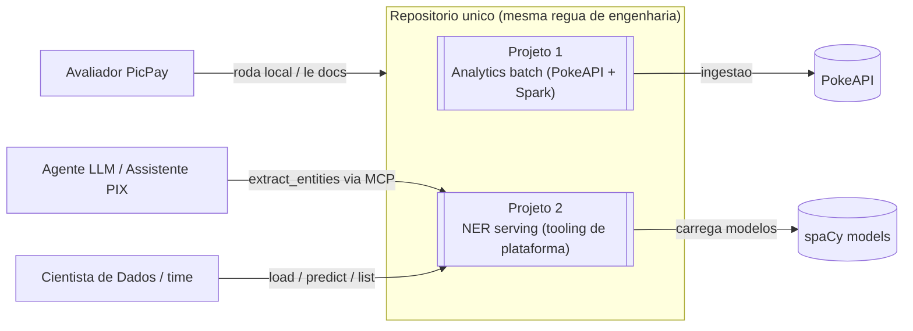
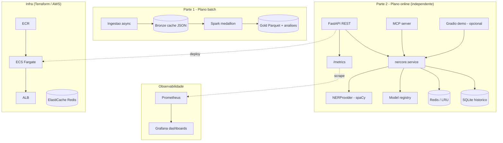
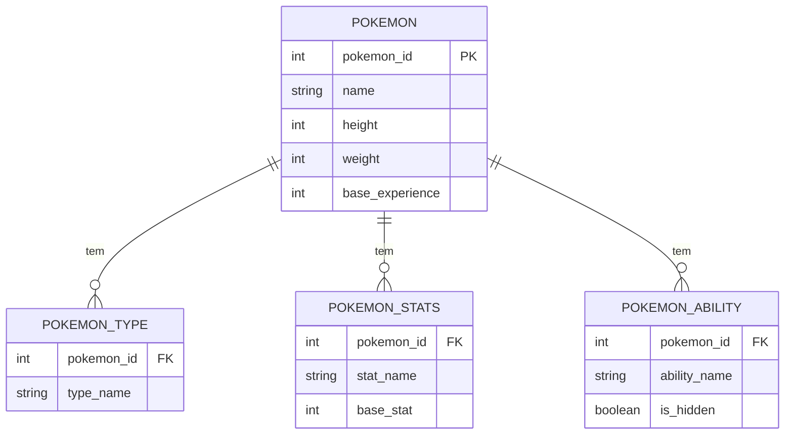
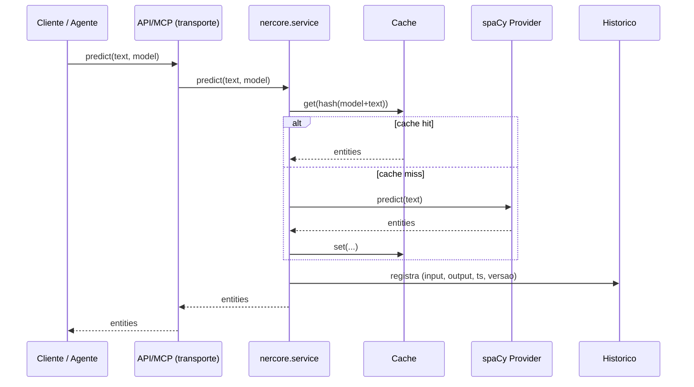

# Arquitetura — PicPay ML Case

> Fonte da verdade do system design. Decisões e tradeoffs por trás de cada escolha estão em
> [`docs/adr/`](adr/README.md).

## 1. Contexto (C4 nível 1) — dois projetos independentes, mesmo repo

## 2. Contêineres (C4 nível 2)

## 3. Modelo de dados (ERD — Parte 1)

## 4. Sequência — `/predict/` com cache

